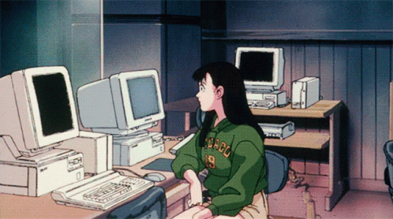

<h1 align="center">Hi,  i'm Fernanda Ferreira</h1>
<h5 align="center">FULL-STACK JR</h5>
<h3 align="center">I'm always open to discovering new things</h3>

    
    

 

    </img>

<h5 align="center" color="white">🌱 Angular and PHP 🌱</h5>

<h5 align="center">Languages and Tools:</h5>

    
    
    
    
    
    
    
    
    
    

<h5 align="center">GitHub stats:</h5>

    
    

